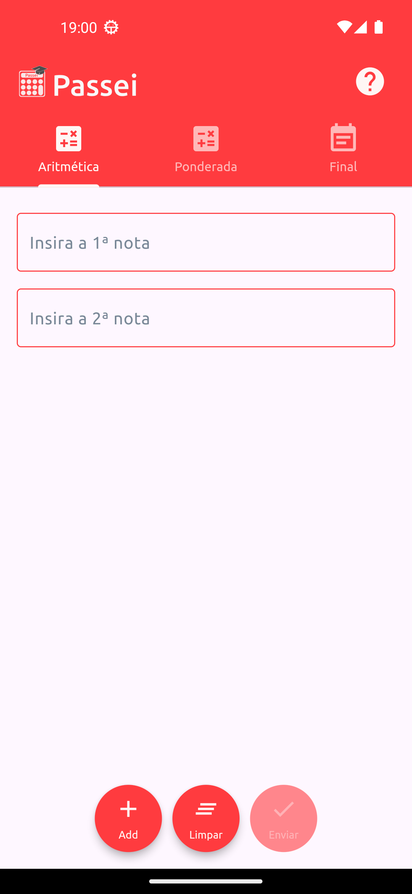
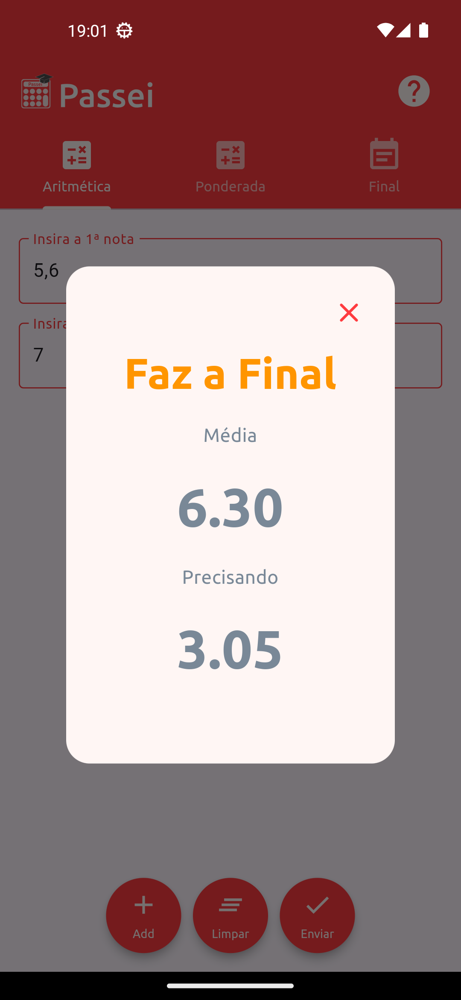

# 📱 Passei

Olá, este é o aplicativo **Passei**! Desenvolvido inteiramente com Flutter, ele ajuda estudantes a calcular rapidamente suas médias aritméticas, ponderadas ou finais. Com base nas informações fornecidas, o aplicativo informa se o aluno está aprovado, precisa fazer a final ou está reprovado.

## 🚀 Funcionalidades

- **Cálculo de Média**: Insira suas notas e obtenha instantaneamente as médias artmética, ponderada e final.
- **Indicação de Aprovação/Reprovação**: Veja claramente se você foi aprovado ou reprovado com base na sua média.
- **Interface Intuitiva**: Interface de usuário simples e limpa, projetada para facilitar a navegação e o uso.
- **Modal de Resultado**: Um modal mostra o resultado, com cores indicativas de aprovação (verde), faz a final (laranja) e reprovação (vermelho), exibe a média obtida e, no caso de final, quanto precisa.

## ⚙️ Como Usar

1. **Clone o Repositório**:
   ```bash
   git clone https://github.com/Everaldo-Martins/passei.git
   ```
2. **Navegue até o Diretório do Projeto**:
   ```bash
   cd passei
   ```
3. **Instale as Dependências**:
   ```bash
   flutter pub get
   ```
4. **Execute o Projeto**:
   ```bash
   flutter run
   ```

## 🖼️ Screenshots

### Tela Principal


---

### Modal de Resultado


---

### Ajuda


---

## ✨ Benefícios

- **Simples e Eficaz**: Calcule suas médias rapidamente sem complicações.
- **Visual Agradável**: Interface moderna e intuitiva.
- **Portátil**: Funciona em dispositivos Android e iOS.

## 📋 Estrutura do Código

A estrutura principal do projeto é composta pelos seguintes arquivos:

- `main.dart`: Ponto de entrada do aplicativo.
- `home_page.dart`: Tela principal que concentra as demais.
- `about_page.dart`: Tela onde ficam as informações sobre o aplicativo, ajuda de uso e redes sociais do dev.
- `arithmetic_average_screen.dart`: Tela onde os cálculo de média aritmética são feitos.
- `weighted_average_screen.dart`: Tela onde os cálculo de média ponderada são feitos.
- `check_final_screen.dart`: Tela onde os cálculo de prova final é feito.
- `assets/`: Diretório para imagens e outros recursos.
- `pubspec.yaml`: Arquivo de configuração do Flutter, onde as dependências são listadas.

## 🌟 Contribuições

Contribuições são bem-vindas! Sinta-se à vontade para abrir issues e pull requests. Veja nosso [Guia de Contribuição](CONTRIBUTING.md) para mais detalhes.

## 📥 Download Apk Android

- [APK Passei](download/app-release.apk)
- [SHA1 Passei](download/app-release.apk.sha1)

## 📄 Licença

Este projeto está licenciado sob a [MIT License](LICENSE).

---

### 🧑‍💻 Desenvolvido por Everaldo Martins

Sinta-se à vontade para entrar em contato e conectar-se comigo no [LinkedIn](https://www.linkedin.com/in/everaldo-martins-de-oliveira-214400b3) ou seguir meus projetos no [GitHub](https://github.com/Everaldo-Martins).

---
